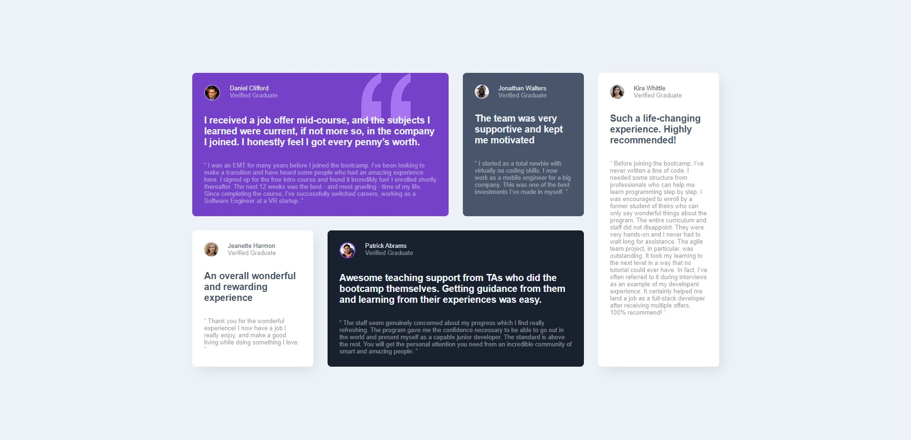

# Testimonials Grid Section - Frontendmentor Challenge

### Description
I have tried to do challenge of frontendmentor. It was funny. I used SCSS, Grid, and flexbox in this challenge.

#### Live Site Link
- https://frontendmentor-grid-section-challenge.netlify.app/

## Built with

### HTML5
- Semantic HTML

### CSS
- SCSS
- Grid
- Flexbox

## Preview

### Desktop Preview

.

### Mobile Preview

.